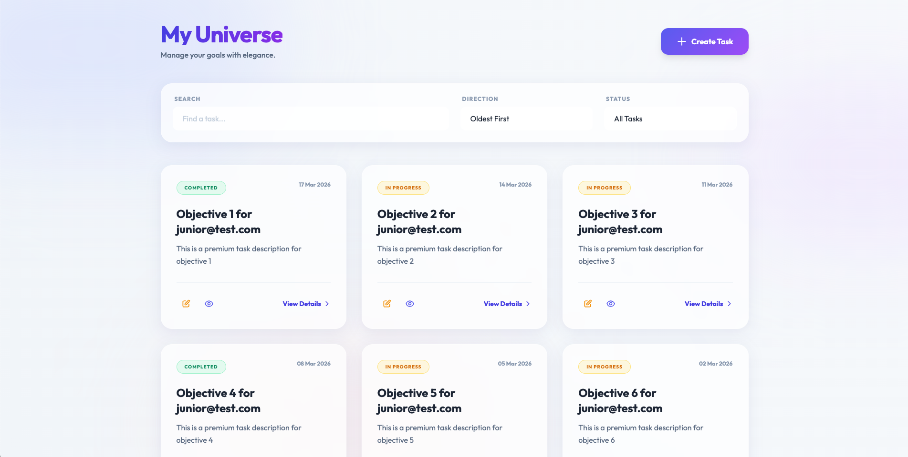
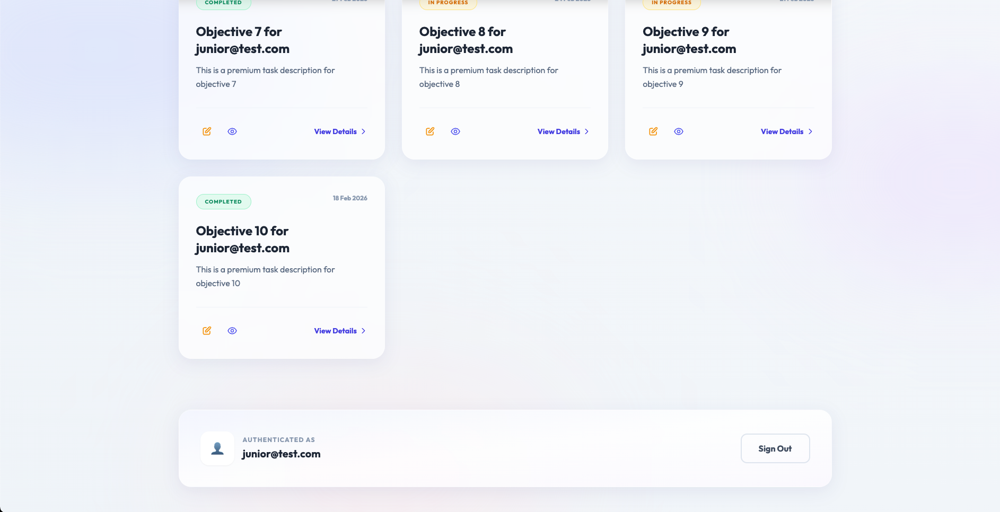
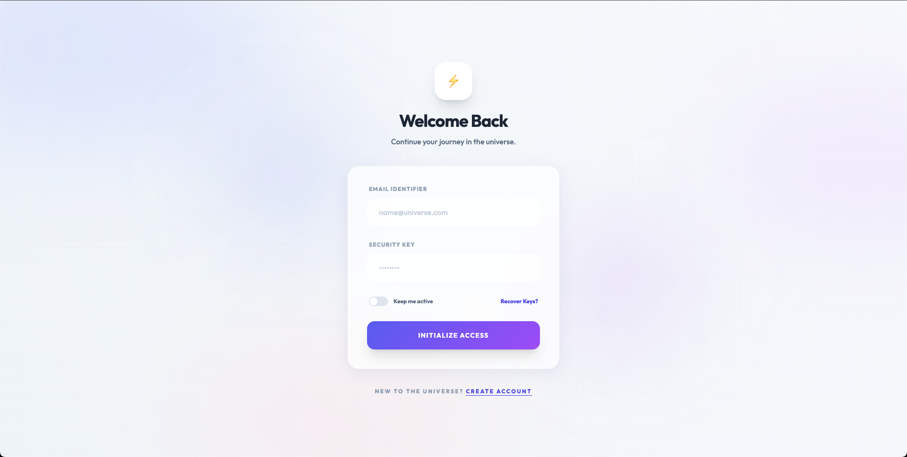

# 🌌 Superior Tasks - Modern Task Management

🚀 **Live Demo:** [https://superior-tasks-production.up.railway.app/](https://superior-tasks-production.up.railway.app/)

Welcome to **Superior Tasks**, a high-end, premium task management application built with **Symfony 8** and **FrankenPHP**. This project was designed with a focus on cutting-edge aesthetics, featuring **Glassmorphism**, **Google Fonts (Outfit)**, and vibrant gradients.

## ✨ Features

- **Premium UI**: Deep glassmorphism cards, animated backgrounds, and micro-animations.
- **Smart Dashboard**: Grid-based task overview with real-time state tracking.
- **Dynamic Forms**: Modern, interactive objective tracking system.
- **High-Performance**: Powered by **FrankenPHP** & **Symfony AssetMapper**.
- **Automated Deployment**: Ready for one-click deployment on Railway/Render.

---

## 📸 Screenshots





> [!TIP]
> These images reflect the final design featuring Glassmorphism and Outfit typography.

---

## 🔑 Mock Credentials (Demo)

For the interview presentation, the following accounts have been pre-configured in the database:

| Role | Email | Password |
| :--- | :--- | :--- |
| **Junior User** | `junior@test.com` | `password` |
| **Senior User** | `senior@test.com` | `password123` |

---

## 🛠️ Performance Stack

- **PHP 8.4**
- **Symfony 8.0**
- **FrankenPHP** (Modern App Server)
- **Tailwind CSS** (via CDN + Custom Context)
- **MySQL 8.0**

---

## 🚀 Quick Setup (Local)

1. **Clone & Install Dependencies**:
   ```bash
   composer install
   ```
2. **Setup Database**:
   ```bash
   php bin/console doctrine:database:create
   php bin/console doctrine:migrations:migrate --no-interaction
   php bin/console doctrine:fixtures:load --no-interaction
   ```
3. **Run Dev Server**:
   ```bash
   symfony server:start
   ```

## ☁️ Deployment

The project is pre-configured for Railway and Render.com.
Detailed technical instructions on how to go live are available in the Deployment Guide..

---

## 🛡️ License

Proprietary - Prepared for Technical Interview Demo.
